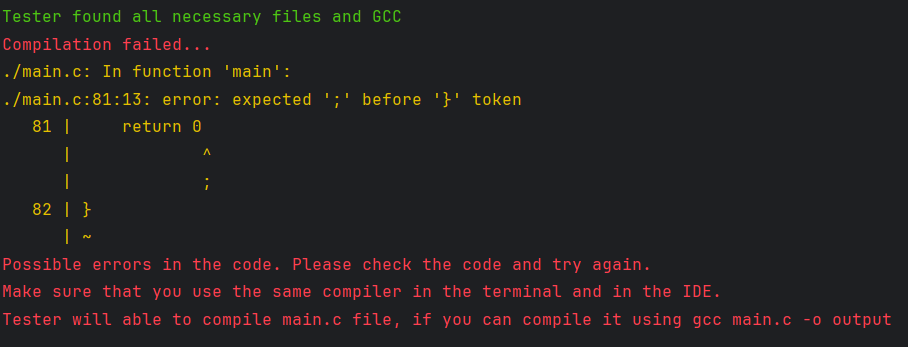
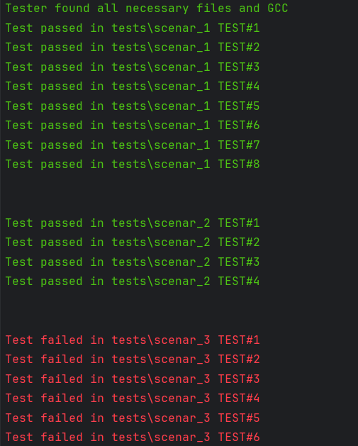
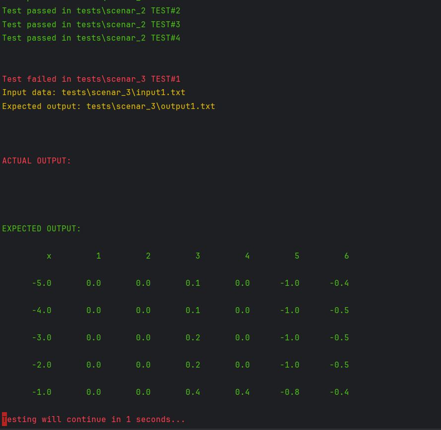

---
<h1>Requirements</h1>

_**- Python (version 3.6+)**_

**_- GCC (version 7.5+, optional: Cygwin, use the same GCC as in your IDE)_**


**_- \*\*Hands growing not from the ass\*\*_**

--- 

### **Starting Guide**

In the working directory, there should be a compilable C file named `main.c`
and an unpacked folder with tests downloaded from the site `prog2.dev`.
Or you can create your own tests with the same structure.

### **Structure Example (only for 1st task, then will be updated)**
```
tests/
├── scenar_1/
│   ├── inputX.txt
│   ├── outputX.txt
├── scenar_2/
│   ├── inputX.txt
│   ├── outputX.txt
├── scenar_3/
│   ├── inputX.txt
│   ├── outputX.txt
├── ....
main.c
tester_reworked.py
```
---
### **How to use?**
To run tests you need to go to directory where 
the script,tests and C file are located and run the following command:

```bash
python tester_reworked.py
``` 

### **Show Difference Mode**
You can use the `-s` or `--show-diff` program argument to run tests in show\_difference mode.
By default, the script will run tests in the usual mode (--show-diff = False).

---
 
```bash
python tester_reworked.py -s 
``` 
```bash
python tester_reworked.py --show-diff
``` 
Tester will run tests and show the difference between the expected and actual output.


---
Example of the output:
---

Example 1


---
---

Example 2


---
---

Example 3


---
---

#### *Author - Arsen Labovich*

#### *All rights reserved. Unauthorized copying or use of this document is prohibited.*

---


#### Contact me in case of problems:

- **Telegram:** [@Laboviiich](https://t.me/Laboviiich)
- **Email:** [arsen.labovich@gmail.com](mailto:arsen.labovich@gmail.com)